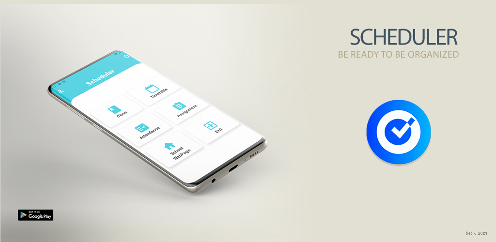
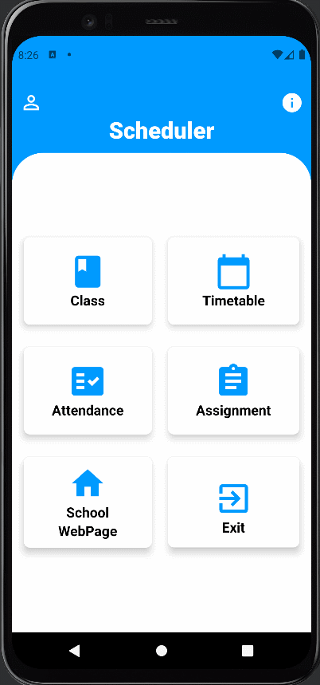
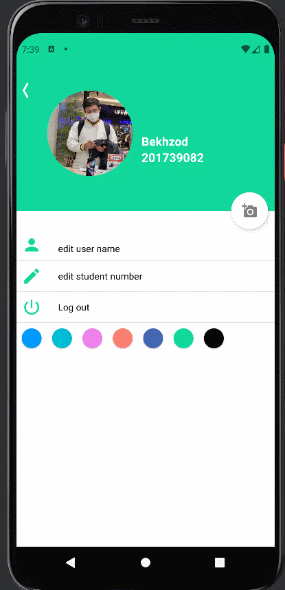
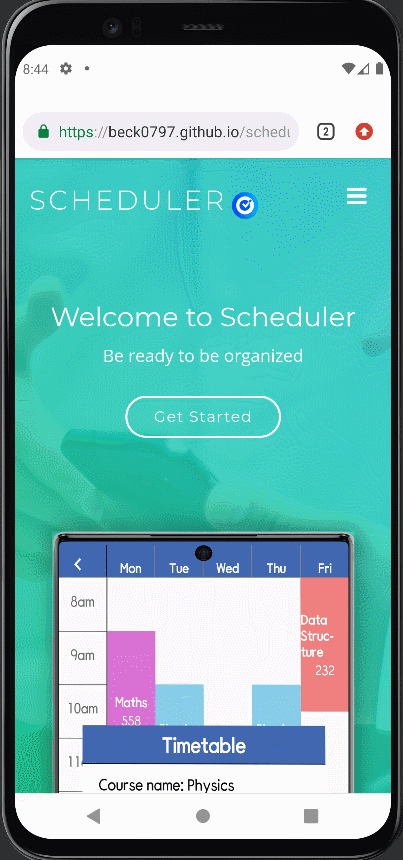
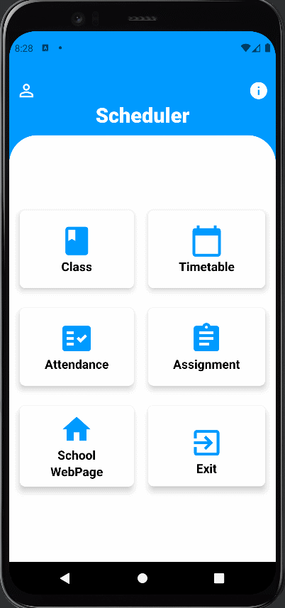
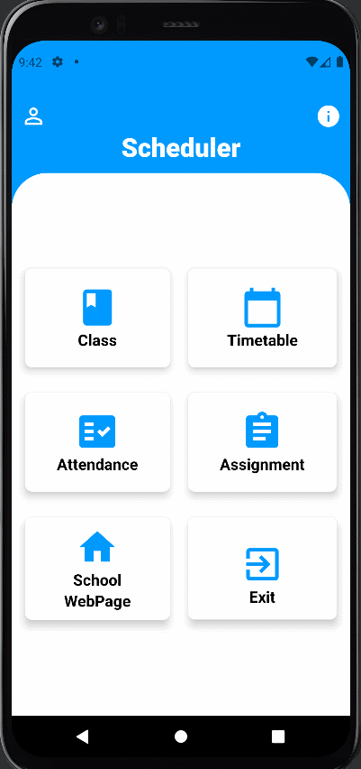

# Scheduler - Personal Course Organizer

## Desciption
Managing classes is easier and more convenient than ever. :tada:  
Our team consists of students which mean that we know how challenging it is to manage attendance and assignments from a number of classes. Therefore, we did our best to develop the software that may help to overcome those difficulties. Our app allows users to:
- [x] Register classes.
- [x] Set alarms before each class.
- [x] Get notified before assignment deadlines.
- [x] Have your online classes links notified before each class.
- [x] Get detailed attendance reports.

[Go to Play Store](https://play.google.com/store/apps/details?id=com.miso.weatherchat)  
[Go to Webpage](https://beck0797.github.io/scheduler_page/)

## 🎬Preview
||||
|---|---|---|
|<h3 align="center">Timetable</h3>|<h3 align="center">Assingment</h3>|<h3 align="center">My Profile</h3>|
||||
|<h3 align="center">Webpage</h3>|<h3 align="center">Attendance</h3>|<h3 align="center">Course</h3>|
